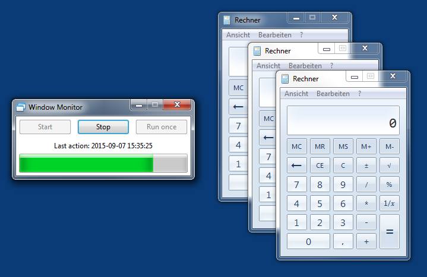

# wxPython Window Monitor

A small Python 2.7 application that periodically puts info about open windows and running processes into a SQlite or PostgreSQL database.

The Python code of the graphical user interface in ``gui.py`` is generated by [wxFormBuilder](http://sourceforge.net/projects/wxformbuilder/) (3.5.0 beta). The editable project file is ``gui.fbp``. Modify this file with WxFormbuilder and select *File*, *Generate code* afterwards.

Upon launch the program waits for the user to push the "Start" button. Then the database is queried for the names of the processes that should be monitored in detail. The counter starts ticking and every few seconds info about open windows and running processes is saved to the database. The user can stop the periodic execution of the function by closing the window or by hitting the "Stop" button. A clean exit is ensured regardless (no thread killing).

## Required non-standard Python libraries

- wxPython [link](http://wxpython.org)
- SQLAlchemy [link](http://www.sqlalchemy.org/)
- psutil [link](https://github.com/giampaolo/psutil)
- pywinauto [link](https://github.com/pywinauto/pywinauto)
- psycopg2 (when using PostgreSQL) [link](https://github.com/psycopg/psycopg2)

The psutil part (process info) should work cross platform (untested). The pywinauto part (window sizes) only works on Microsoft Windows.

## Database schema

")

## Sample database content

## Sources

- [wxPython Window Monitor on GitHub](https://github.com/geberl/wxpython_window_monitor)
- [wxPython Threading Template on GitHub](https://github.com/geberl/wxpython_threading_template) (basis for periodically executed script with GUI)
- [eberl.se](http://www.eberl.se)